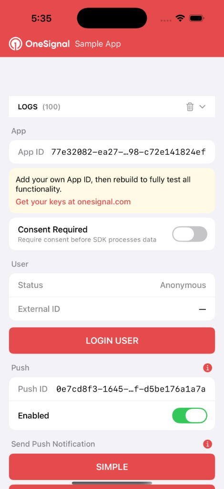
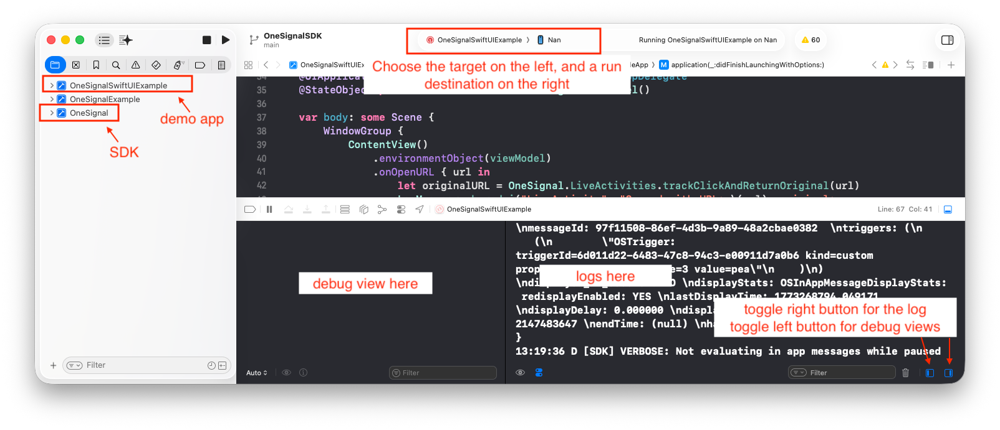
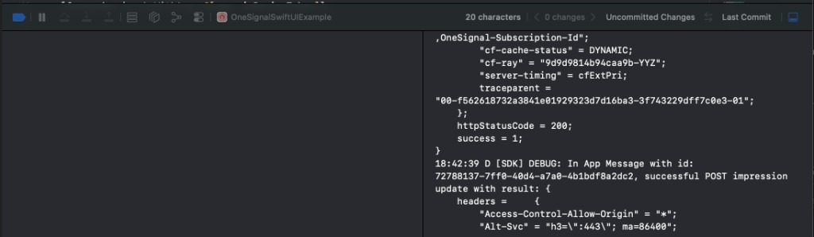

# Getting Started with the Red App

The **Red App** is a SwiftUI sample application that exercises every major feature of the OneSignal iOS SDK. Use it to validate SDK behavior, test integrations, and explore the API surface on a simulator or physical device.

<p align="center">
  
</p>

## Prerequisites

| Requirement | Minimum Version |
|-------------|-----------------|
| macOS       | 13 Ventura+     |
| Xcode       | 15.0+           |
| Swift       | 5.9+            |
| iOS target  | 16.0+           |

## Running the App

### Option A — Open via the workspace (recommended)

<p align="center">
  
</p>

1. Open `iOS_SDK/OneSignalSDK.xcworkspace` in Xcode.
2. In the scheme selector (top-left toolbar), choose **OneSignalSwiftUIExample**.
3. Pick a simulator (e.g. iPhone 17 Pro) or a connected device.
4. Press **Cmd + R** to build and run.

Your Xcode toolbar should look like this above — scheme set to **OneSignalSwiftUIExample**, a simulator or physical device chosen, and the app running.

The workspace contains multiple schemes. Make sure **OneSignalSwiftUIExample** is selected.

Once the app is running, SDK debug logs stream to the Xcode console — useful for verifying network calls, subscription state, and in-app message events:

<p align="center">
  
</p>

### Option B — Open from the terminal

```bash
open iOS_SDK/OneSignalSDK.xcworkspace
```

Then follow steps 2–4 from Option A.

### Option C — Open only the example project

> Use this if you only need the sample app and don't plan to modify the SDK source.

```bash
open iOS_SDK/OneSignalSwiftUIExample/OneSignalSwiftUIExample.xcodeproj
```

Select the **OneSignalSwiftUIExample** scheme, pick a destination, and run.

> **Note:** Opening the `.xcworkspace` (Options A/B) is preferred because it links the sample app against the SDK source, so any local SDK changes are picked up automatically.

## Using Your Own App ID

The default App ID (`77e32082-ea27-...c72e141824ef`) is a shared test key. To use your own:

**Changing the App ID requires uninstalling and reinstalling the app for it to take effect.**

1. Open `iOS_SDK/OneSignalSwiftUIExample/OneSignalSwiftUIExample/Services/OneSignalService.swift`.
2. Replace the `defaultAppId` value with your OneSignal App ID (available at [onesignal.com](https://onesignal.com)).
3. Then uninstall the app from the device/simulator and run it again.

## Features

The Red App is organized into scrollable sections, each mapping to a OneSignal SDK capability:

| Section | What It Does |
|---------|-------------|
| **Logs** | Collapsible live SDK log viewer with a configurable entry limit and clear button. |
| **App Info** | Displays the current App ID and a consent-required toggle that gates SDK data processing. |
| **User** | Shows login status (Anonymous / Identified) and External ID. Login and logout buttons to switch between user states. |
| **Push** | Displays the Push Subscription ID, an enable/disable toggle, and permission status. |
| **Send Push Notification** | Quick-fire buttons (Simple, Custom) to send test push notifications to the current device. |
| **In-App Messaging** | Pause/resume in-app messages. |
| **Send In-App Message** | Trigger a test in-app message. |
| **Aliases** | Add and remove key-value aliases for the current user. |
| **Email** | Add and remove email subscriptions. |
| **SMS** | Add and remove SMS subscriptions. |
| **Tags** | Manage user tags used for audience segmentation. |
| **Outcome Events** | Fire unique, regular, or valued outcome events for analytics. |
| **Triggers** | Set and remove in-app message triggers. |
| **Track Event** | Send custom user events with optional properties. |
| **Location** | Toggle location sharing and request location permissions. |
| **Live Activities** | Start and manage iOS Live Activities via OneSignal. |

## Troubleshooting

| Problem | Fix |
|---------|-----|
| Build fails with missing framework | Make sure you opened the **`.xcworkspace`**, not the `.xcodeproj`. |
| Push notifications don't arrive on simulator | Push delivery requires a **physical device** with a valid APNs configuration. The simulator supports permission prompts and token generation but won't receive remote pushes. |
| "Consent Required" blocks SDK calls | Toggle **Consent Required** off, or call the consent API to grant consent. |
